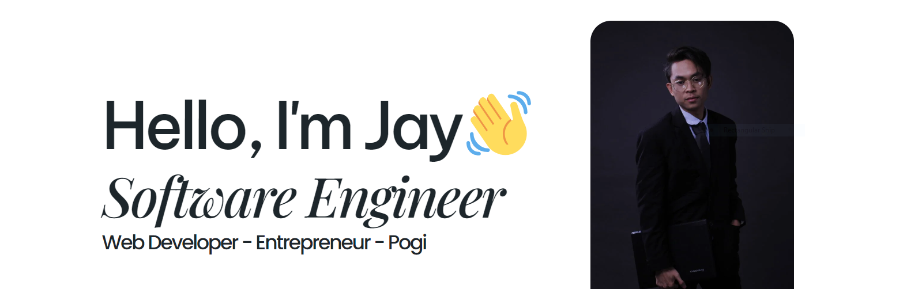

# Hello, I'm Jay, a self taught Web Developer 👋

A self motivated software engineer with experience in managing projects. 🔥 🚀

- 🚀 I’m currently a project manager at **[Codebility](https://codebility.tech)**

- 🚀 I’m currently working on my own framework and boilerplate

- 🚀 All of my projects completed in private

- 🚀 2025 Goals: **Focus more on collaboration and network**

- 📄 Learn more: **https://jaymelendrez.tech/**

<h3 align="left">Languages:</h3>

<h3 align="left">Frontend Frameworks:</h3>

<h3 align="left">Backend Frameworks:</h3>

<h3 align="left">A.I Frameworks:</h3>

<h3 align="left">Database:</h3>

<h3 align="left">Tools:</h3>

